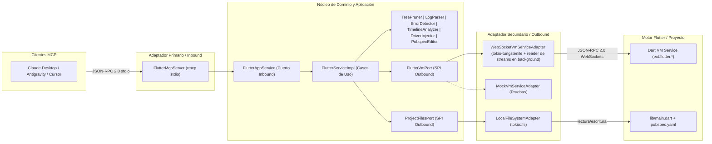

# Flutter MCP 🚀 (Español)

[](https://github.com/guty3rrez/flutter-mcp/actions/workflows/ci.yml)
[](https://www.gnu.org/licenses/agpl-3.0)
[](https://www.rust-lang.org/)
[](https://modelcontextprotocol.io/)

> **Servidor Model Context Protocol (MCP) de alto rendimiento escrito en Rust para automatización nativa de UI, introspección e inspección, y pruebas End-to-End (E2E) en Flutter.**

📖 **[English Version](README.md)**

---

## 💡 ¿Por qué Flutter MCP?

Los agentes autónomos de desarrollo con IA (Claude Desktop, Antigravity, Cursor, Windsurf) interactúan eficazmente con aplicaciones web gracias a herramientas de automatización como Playwright o Puppeteer. Sin embargo, **fallan por completo al intentar interactuar con aplicaciones Flutter nativas** (Linux Desktop, macOS, Windows, Android, iOS).

Flutter no utiliza la jerarquía DOM tradicional de los sistemas operativos: dibuja cada widget directamente sobre un lienzo gráfico de GPU utilizando motores como Skia o Impeller.

**`flutter-mcp` soluciona este problema.** Construido en Rust con Arquitectura Hexagonal:
- 🔌 **Conexión Directa al Dart VM:** Comunicación bidireccional JSON-RPC 2.0 sobre WebSockets directamente con el motor de Flutter.
- 🌳 **Cero Ruido de Maquetación (`TreePruner`):** Filtra cientos de contenedores estructurales repetitivos (`Padding`, `SizedBox`, `DecoratedBox`, `Transform`), condensando el árbol en tokens semánticos de alto valor optimizados para la ventana de contexto del LLM (<2ms de latencia).
- ⚡ **Gestos y Control Nativo:** Taps, ingreso de texto, desplazamiento (scroll), alineación en pantalla (`scroll_into_view`), esperas asíncronas sincronizadas, capturas de pantalla y Hot Reload / Hot Restart en vivo.
- 🧪 **Pruebas E2E Full-Stack Reales:** Permite a los agentes validar flujos completos cruzando la UI nativa, APIs backend y bases de datos locales (PostgreSQL, SQLite).

---

## 🛠️ Catálogo de Herramientas MCP (19 Herramientas)

`flutter-mcp` expone 19 herramientas a través del Model Context Protocol:

| Herramienta | Parámetros | Descripción |
| :--- | :--- | :--- |
| `flutter_connect` | `uri: String` | Conecta con el WebSocket del Dart VM Service de la app Flutter activa. |
| `flutter_disconnect` | *(ninguno)* | Cierra limpiamente la sesión activa del Dart VM Service. |
| `flutter_snapshot` | *(ninguno)* | Obtiene el árbol podado de UI en formato JSON semántico para LLMs. |
| `flutter_tap` | `by: String`, `value: String`, `timeout_ms: Option<u64>` | Realiza un tap nativo buscando por `key`, `text`, `tooltip`, `type` o `semantics`. `timeout_ms` permite override opcional de la heurística automática de pre-chequeo (fast-fail vs. default), enviado tal cual a Flutter Driver. |
| `flutter_pop` | `timeout_ms: Option<u64>` | Ejecuta el gesto de retroceso estándar de Flutter Driver (`PageBack`: tooltip "Back" con fallback por tipo de widget, independiente del idioma). Preferible sobre `flutter_tap(by: "tooltip", value: "Back")`, que no tiene ese fallback. |
| `flutter_enter_text` | `by: String`, `value: String`, `text: String`, `timeout_ms: Option<u64>` | Escribe texto en campos interactivos (`TextField`, `TextFormField`). `timeout_ms` override del tap de foco previo al ingreso de texto. |
| `flutter_get_text` | `by: String`, `value: String` | Extrae el texto legible de cualquier widget de la pantalla. |
| `flutter_scroll` | `by`, `value`, `dx`, `dy`, `duration_ms`, `frequency`, `timeout_ms: Option<u64>` | Realiza scroll programático sobre contenedores (`ListView`, `CustomScrollView`). |
| `flutter_scroll_into_view` | `by`, `value`, `alignment`, `timeout_ms: Option<u64>` | Desplaza un contenedor hasta que el widget objetivo sea visible en pantalla. |
| `flutter_wait_for` | `by`, `value`, `timeout_ms` | Espera asíncrona a que un widget aparezca en el árbol antes de continuar. |
| `flutter_wait_for_absent` | `by`, `value`, `timeout_ms` | Espera asíncrona a que un widget desaparezca (spinners de carga, modales). |
| `flutter_screenshot` | `save_path: Option<String>` | Captura de pantalla nativa (PNG) con soporte de guardado en disco. |
| `flutter_hot_reload` | *(ninguno)* | Recarga en caliente instantánea sin perder el estado de la aplicación. |
| `flutter_hot_restart` | *(ninguno)* | Reinicio completo y reensamblado del árbol de widgets en la app Flutter. |
| `flutter_start_control` | `project_root`, `entrypoint`, `revert_after_restart` | Inyecta en caliente Flutter Driver en el entrypoint de una app YA conectada (sin necesitar un `main_driver.dart` separado) y dispara un Hot Restart para activarlo. Requiere que `flutter_driver` ya sea una dependencia resuelta del proyecto — ver [Inyección de control en vivo](#-inyección-de-control-en-vivo-sin-necesitar-main_driverdart) más abajo. |
| `flutter_get_logs` | `filter`, `source`, `limit` | Lee stdout/stderr/`dart:developer.log` acumulados desde la conexión. Por defecto, las últimas 100 líneas. |
| `flutter_get_errors` | `limit`, `precise` | Lee errores de framework (red screens) que la app imprimió por stdout/stderr. **Limitación validada:** no detecta excepciones Dart/async genéricas no capturadas — el engine las reporta directo a stderr nativo, sin pasar por el sink `dart:io` que esta tool observa; `precise: true` (modo pausa en excepción) tampoco las capturó en pruebas contra un dispositivo real. |
| `flutter_get_performance` | `window_ms`, `include_frames` | Obtiene un reporte de jank/build/raster derivado del stream `Timeline` acumulado. |
| `flutter_driver_raw` | `command: String`, `params: object` | Passthrough a un comando arbitrario de `ext.flutter.driver` por nombre, para comandos del SDK o extensiones de driver personalizadas no cubiertas por una tool dedicada. |

---

## 📦 Instalación y Configuración

### Opción 1: Binarios Precompilados (Recomendado)
Descarga la última versión para tu sistema operativo desde [GitHub Releases](https://github.com/guty3rrez/flutter-mcp/releases):
- Linux (x86_64)
- macOS (Apple Silicon `aarch64` e Intel `x86_64`)
- Windows (x86_64)

Extrae y mueve el ejecutable a una ruta en tu PATH (ej. `~/.local/bin/flutter-mcp`).

### Opción 2: Instalación vía Cargo
```bash
cargo install --git https://github.com/guty3rrez/flutter-mcp
```

### Opción 3: Compilar desde el Código Fuente
```bash
git clone https://github.com/guty3rrez/flutter-mcp.git
cd flutter-mcp
cargo build --release
cp target/release/flutter-mcp ~/.local/bin/
```

---

## ⚙️ Configuración

### 1. Activar la Extensión Flutter Driver en tu App
En tu proyecto Flutter, asegúrate de habilitar `enableFlutterDriverExtension()` en modo de pruebas o desarrollo:

```dart
// lib/main_driver.dart
import 'package:flutter_driver/driver_extension.dart';
import 'package:mi_app/main.dart' as app;

void main() {
  enableFlutterDriverExtension();
  app.main();
}
```

Inicia tu aplicación:
```bash
flutter run -d linux -t lib/main_driver.dart
# Toma nota de la URI del Dart VM Service que imprime la consola:
# A Dart VM Service on Linux is available at: ws://127.0.0.1:45678/ws
```

#### 🚀 Inyección de control en vivo (sin necesitar `main_driver.dart`)

Si preferís no mantener un entrypoint separado, lanzá la app de forma normal (`flutter run -d linux`, sin el flag `-t`) y llamá a `flutter_start_control` **después** de `flutter_connect`:

1. `flutter_driver` debe ser ya una dependencia resuelta del proyecto (declarada en `pubspec.yaml` y presente en `pubspec.lock`). Si no lo es, `flutter_start_control` la agrega a `dev_dependencies` y se detiene ahí — corré `flutter pub get` y **reiniciá por completo** `flutter run` (un Hot Restart solo no alcanza para resolver una dependencia nueva), y volvé a llamar a la tool.
2. Una vez resuelta, `flutter_start_control` parcha `lib/main.dart` (o el `entrypoint` que le pases) para llamar a `enableFlutterDriverExtension()` antes de `runApp()`, y dispara un Hot Restart para que `main()` se re-ejecute con el parche aplicado — sin necesidad de relanzar el proceso. Es idempotente: si el entrypoint ya tiene la extensión habilitada, solo dispara el Hot Restart.
3. Por defecto el cambio queda en el archivo (para sobrevivir a futuros Hot Reload/Restart de la sesión). Pasá `revert_after_restart: true` para restaurar el archivo original justo después del restart — la extensión igual queda registrada en el binding de la app en ejecución, ya que ese registro vive en memoria, no en el archivo fuente.

Esto funciona igual bajo [FVM](https://fvm.app/): la dependencia `sdk: flutter` que se inyecta resuelve contra el SDK de Flutter que esté fijado para el proyecto (`.fvm/flutter_sdk`), igual que cualquier otra dependencia.

### 2. Configurar Clientes MCP

#### Claude Desktop (`claude_desktop_config.json`)
```json
{
  "mcpServers": {
    "flutter_mcp": {
      "command": "flutter-mcp",
      "args": []
    }
  }
}
```

#### Claude Code (CLI)
Registra el servidor con el comando `claude mcp add` en vez de editar un archivo de configuración a mano:
```bash
claude mcp add flutter_mcp -s user -- /ruta/a/flutter-mcp
```
- `-s user` lo deja disponible en todos tus proyectos; usa `-s local` (por defecto) para limitarlo al repo actual, o `-s project` para compartirlo con tu equipo vía `.mcp.json`.
- Verifica que quedó conectado con `claude mcp list`.

#### Antigravity CLI / Gemini (`~/.gemini/config/mcp_config.json`)
```json
{
  "mcpServers": {
    "flutter_mcp": {
      "command": "/home/<tu-usuario>/.local/bin/flutter-mcp",
      "args": []
    }
  }
}
```

---

## 🏗️ Arquitectura

`flutter-mcp` está diseñado mediante **Arquitectura Hexagonal (Puertos y Adaptadores)** para aislar la lógica de dominio de los protocolos de transporte y detalles del SDK:



---

## 🤝 Contribuciones y Control de Calidad

¡Las contribuciones de la comunidad son bienvenidas! Revisa nuestra [Guía de Contribución](CONTRIBUTING.es.md) y el [Código de Conduct](CODE_OF_CONDUCT.md).

### Reglas para Pull Requests:
1. **Nunca hacer push directo a `main`**: Crea siempre una rama desde `main` (`feature/mi-funcionalidad` o `fix/descripcion-error`).
2. **Control de Calidad Obligatorio**: Todo Pull Request debe pasar sin excepciones la suite de CI de GitHub Actions:
   - `cargo fmt --check`
   - `cargo clippy --all-targets -- -D warnings`
   - `cargo test --all-targets` (Pruebas unitarias, de integración y BDD Gherkin)
   - `cargo audit`

Ejecuta la suite completa de verificación localmente antes de abrir tu PR:
```bash
./scripts/verify_harness.sh
```

---

## 📄 Licencia

Este proyecto está licenciado bajo la **GNU Affero General Public License v3.0 (AGPLv3)**.  
Consulta el archivo [LICENSE](LICENSE) para más detalles.
