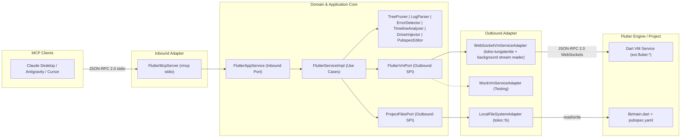

# Flutter MCP 🚀

[](https://github.com/guty3rrez/flutter-mcp/actions/workflows/ci.yml)
[](https://www.gnu.org/licenses/agpl-3.0)
[](https://www.rust-lang.org/)
[](https://modelcontextprotocol.io/)

> **High-performance Model Context Protocol (MCP) server written in Rust for native Flutter UI automation, introspection, and End-to-End (E2E) testing.**

📖 **[Versión en Español (Spanish Version)](README.es.md)**

---

## 💡 Why Flutter MCP?

Autonomous AI coding agents (Claude Desktop, Antigravity, Cursor, Windsurf) interact effectively with web applications using browser automation tools like Playwright or Puppeteer. However, **they fail when attempting to interact with native Flutter applications** (Linux Desktop, macOS, Windows, Android, iOS).

Flutter bypasses standard operating system DOM hierarchies and renders UI widgets directly onto a GPU canvas using Skia or Impeller.

**`flutter-mcp` bridges this gap.** Written in Rust with Hexagonal Architecture:
- 🔌 **Direct Dart VM Connection:** Speaks JSON-RPC 2.0 over WebSockets directly to the Flutter engine.
- 🌳 **Zero Layout Noise (`TreePruner`):** Strips away hundreds of boilerplate layout nodes (`Padding`, `SizedBox`, `DecoratedBox`, `Transform`), compressing the UI hierarchy into clean, high-signal semantic tokens tailored for LLM context windows (<2ms pruning).
- ⚡ **Native Gestures & Controls:** Taps, text entry, scrolling, scroll-into-view, async waits, screenshots, and live Hot Reload / Hot Restart.
- 🧪 **True Full-Stack E2E Testing:** Allows AI agents to validate user flows across UI, backend APIs, and local databases (PostgreSQL, SQLite).

---

## 🛠️ MCP Tools Reference (18 Tools)

`flutter-mcp` exposes 18 tools via the Model Context Protocol:

| Tool | Parameters | Description |
| :--- | :--- | :--- |
| `flutter_connect` | `uri: String` | Connect to the running Flutter app's Dart VM Service WebSocket. |
| `flutter_disconnect` | *(none)* | Cleanly disconnect from the active Dart VM Service session. |
| `flutter_snapshot` | *(none)* | Retrieve the pruned, semantic UI widget tree optimized for LLMs. |
| `flutter_tap` | `by: String`, `value: String` | Perform a native tap by `key`, `text`, `tooltip`, `type`, or `semantics`. |
| `flutter_enter_text` | `by: String`, `value: String`, `text: String` | Type text into interactive form fields (`TextField`, `TextFormField`). |
| `flutter_get_text` | `by: String`, `value: String` | Extract visible text content from any widget. |
| `flutter_scroll` | `by`, `value`, `dx`, `dy`, `duration_ms`, `frequency` | Programmatically scroll a scrollable widget (`ListView`, `CustomScrollView`). |
| `flutter_scroll_into_view` | `by`, `value`, `alignment` | Scroll an ancestor container until the target element is visible in the viewport. |
| `flutter_wait_for` | `by`, `value`, `timeout_ms` | Asynchronously wait for a widget to appear in the tree. |
| `flutter_wait_for_absent` | `by`, `value`, `timeout_ms` | Asynchronously wait for a widget to disappear (loading indicators, dialogs). |
| `flutter_screenshot` | `save_path: Option<String>` | Capture a native PNG screenshot directly from the engine framebuffer. |
| `flutter_hot_reload` | *(none)* | Trigger an instant Hot Reload without losing application state. |
| `flutter_hot_restart` | *(none)* | Trigger a complete Hot Restart / Reassemble of the Flutter application. |
| `flutter_start_control` | `project_root`, `entrypoint`, `revert_after_restart` | Hot-inject Flutter Driver control into an already-connected app's entrypoint (no separate `main_driver.dart` launch required) and trigger a Hot Restart to activate it. Requires `flutter_driver` to already be a resolved project dependency — see [Live control injection](#-live-control-injection-no-main_driverdart-needed) below. |
| `flutter_get_logs` | `filter`, `source`, `limit` | Read stdout/stderr/`dart:developer.log` output buffered since connecting. Defaults to the last 100 lines. |
| `flutter_get_errors` | `limit`, `precise` | Read framework errors (red screens) the app printed to stdout/stderr. **Validated limitation:** does not catch generic uncaught Dart/async exceptions — the engine reports those directly to native stderr, bypassing the `dart:io` sink this tool observes; `precise: true` (exception-pause mode) did not catch that case either in real-device testing. |
| `flutter_get_performance` | `window_ms`, `include_frames` | Get a jank/build/raster report derived from the accumulated `Timeline` stream. |
| `flutter_driver_raw` | `command: String`, `params: object` | Passthrough to an arbitrary `ext.flutter.driver` command by name, for SDK commands or custom driver extensions not covered by a dedicated tool. |

---

## 📦 Installation & Setup

### Option 1: Precompiled Binaries (Recommended)
Download the latest precompiled release for your architecture from [GitHub Releases](https://github.com/guty3rrez/flutter-mcp/releases):
- Linux (x86_64)
- macOS (Apple Silicon `aarch64` & Intel `x86_64`)
- Windows (x86_64)

Extract and move the binary to your PATH (e.g. `~/.local/bin/flutter-mcp`).

### Option 2: Install via Cargo
```bash
cargo install --git https://github.com/guty3rrez/flutter-mcp
```

### Option 3: Build from Source
```bash
git clone https://github.com/guty3rrez/flutter-mcp.git
cd flutter-mcp
cargo build --release
cp target/release/flutter-mcp ~/.local/bin/
```

---

## ⚙️ Configuration

### 1. Enable Flutter Driver Extension in Your App
In your Flutter project, ensure `enableFlutterDriverExtension()` is enabled during test/debug mode:

```dart
// lib/main_driver.dart
import 'package:flutter_driver/driver_extension.dart';
import 'package:my_app/main.dart' as app;

void main() {
  enableFlutterDriverExtension();
  app.main();
}
```

Run your application:
```bash
flutter run -d linux -t lib/main_driver.dart
# Note the Dart VM Service URI output, e.g.:
# A Dart VM Service on Linux is available at: ws://127.0.0.1:45678/ws
```

#### 🚀 Live control injection (no `main_driver.dart` needed)

If you'd rather not maintain a separate entrypoint, launch the app normally (`flutter run -d linux`, no `-t` flag) and call `flutter_start_control` **after** `flutter_connect`:

1. `flutter_driver` must already be a resolved dependency of the project (declared in `pubspec.yaml` and present in `pubspec.lock`). If it isn't, `flutter_start_control` adds it to `dev_dependencies` and stops there — run `flutter pub get` and **fully restart** `flutter run` (a Hot Restart alone can't resolve a brand-new dependency), then call the tool again.
2. Once resolved, `flutter_start_control` patches `lib/main.dart` (or the `entrypoint` you pass) to call `enableFlutterDriverExtension()` before `runApp()`, and triggers a Hot Restart so `main()` re-executes with the patch applied — no process relaunch required. It's idempotent: if the entrypoint already has the extension enabled, it only triggers the Hot Restart.
3. By default the source change stays on disk (so it survives further Hot Reloads/Restarts in the session). Pass `revert_after_restart: true` to restore the original file right after the restart — the extension stays registered in the running app's binding regardless, since that registration lives in memory, not in the source file.

This works the same way under [FVM](https://fvm.app/): the injected `sdk: flutter` dependency resolves against whichever Flutter SDK is pinned for the project (`.fvm/flutter_sdk`), same as any other dependency.

### 2. Configure MCP Clients

#### Claude Desktop (`claude_desktop_config.json`)
```json
{
  "mcpServers": {
    "flutter_mcp": {
      "command": "flutter-mcp",
      "args": []
    }
  }
}
```

#### Claude Code (CLI)
Register the server with the `claude mcp add` command instead of editing a config file by hand:
```bash
claude mcp add flutter_mcp -s user -- /path/to/flutter-mcp
```
- `-s user` makes it available across all your projects; use `-s local` (default) to scope it to the current repo only, or `-s project` to share it via `.mcp.json` with your team.
- Verify it connected with `claude mcp list`.

#### Antigravity CLI / Gemini (`~/.gemini/config/mcp_config.json`)
```json
{
  "mcpServers": {
    "flutter_mcp": {
      "command": "/home/<your-user>/.local/bin/flutter-mcp",
      "args": []
    }
  }
}
```

---

## 🏗️ Architecture

`flutter-mcp` is designed using **Hexagonal Architecture (Ports and Adapters)** to decouple business domain rules from transport protocols and SDK internals:



---

## 🤝 Contributing & Quality Gate

We welcome community contributions! Please review our [Contributing Guide](CONTRIBUTING.md) and [Code of Conduct](CODE_OF_CONDUCT.md).

### Pull Request Rules:
1. **Never commit directly to `main`**: Always branch from `main` (`feature/my-feature` or `fix/issue-description`).
2. **Mandatory Quality Gate**: Every pull request must pass the automated GitHub Actions CI suite:
   - `cargo fmt --check`
   - `cargo clippy --all-targets -- -D warnings`
   - `cargo test --all-targets` (Unit, Integration, and BDD Gherkin tests)
   - `cargo audit`

Run the entire verification suite locally before opening a PR:
```bash
./scripts/verify_harness.sh
```

---

## 📄 License

This project is licensed under the **GNU Affero General Public License v3.0 (AGPLv3)**.  
See the [LICENSE](LICENSE) file for details.
